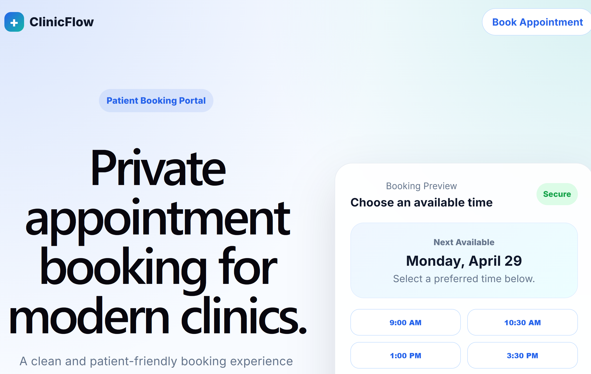
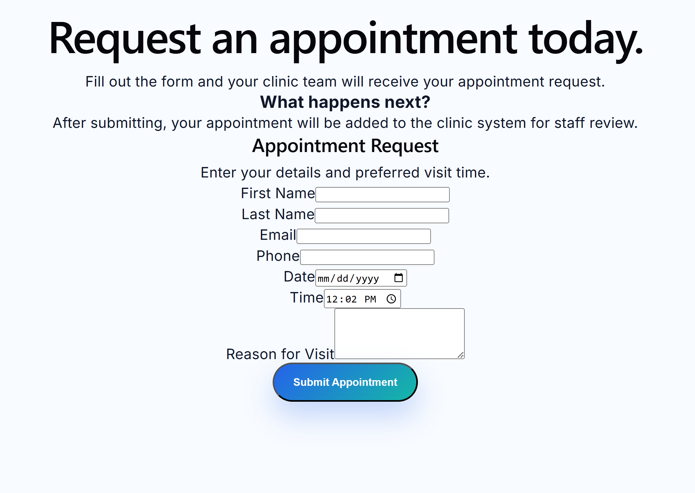
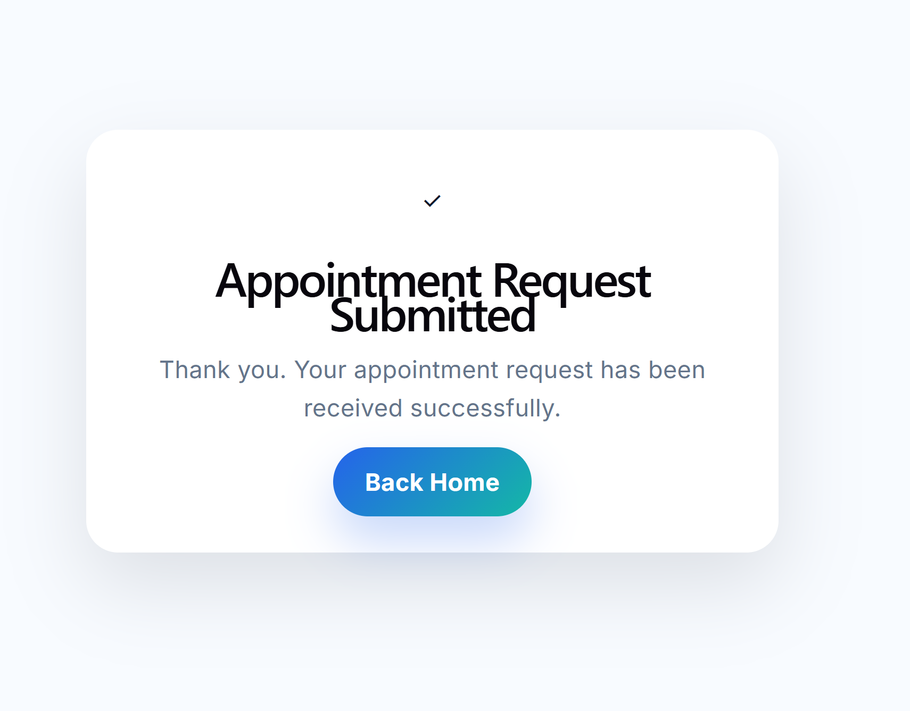

# ClinicFlow Booking Portal
A modern, patient-friendly appointment booking portal built with the MERN stack.
This application allows patients to request appointments online while maintaining strict data privacy and separation from internal clinic systems.

## 📸 Screenshots

### Landing Page

### Booking Form

### Confirmation Page

## Features
- Patient appointment request form
- Privacy-first design (no exposure of other patient data)
- Fast and responsive UI
-  Modern healthcare SaaS-style interface
- Connected to backend API
- Booking request flow for clinic staff review

## System Design
This project follows a real-world architecture:

### Patient Portal 
- Public-facing booking interface
- No authentication required
- Submits appointment requests

### ClinicFlow Backend
- Handles booking requests
- Stores data securely
- Converts requests into real appointments

## Tech Stack

### Frontend
- React (Vite)
- JavaScript
- CSS

### Backend
- Node.js
- Express
- MongoDB
- Mongoose

## Key Decisions
- Separated Booking Requests from Appointments for better scalability
- Backend controls status (not frontend) for data integrity
- Designed UI with a privacy-first approach

## Future Improvements
- Admin dashboard to manage booking requests
- Convert booking requests into appointments
- Email notifications
- Authentication for patient tracking
- Calendar integration

## 👨‍💻 Author

Carol Mbafou
GitHub: https://github.com/mbafousu
